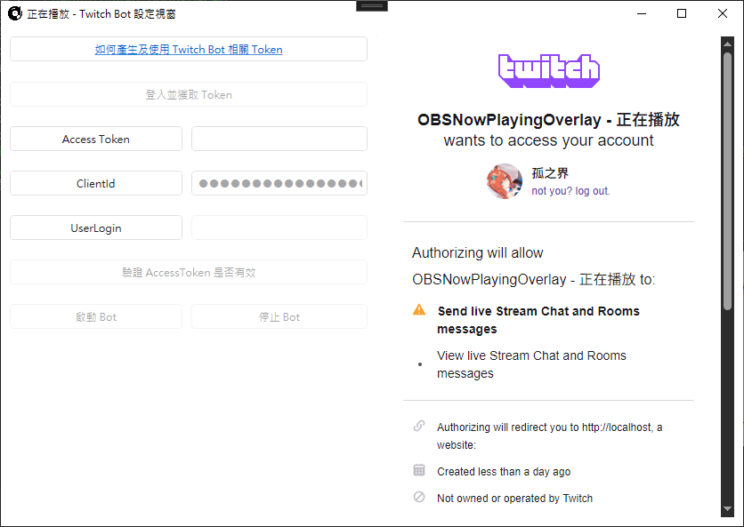
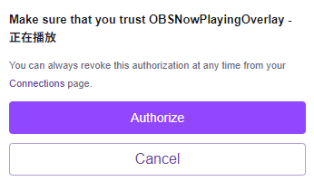
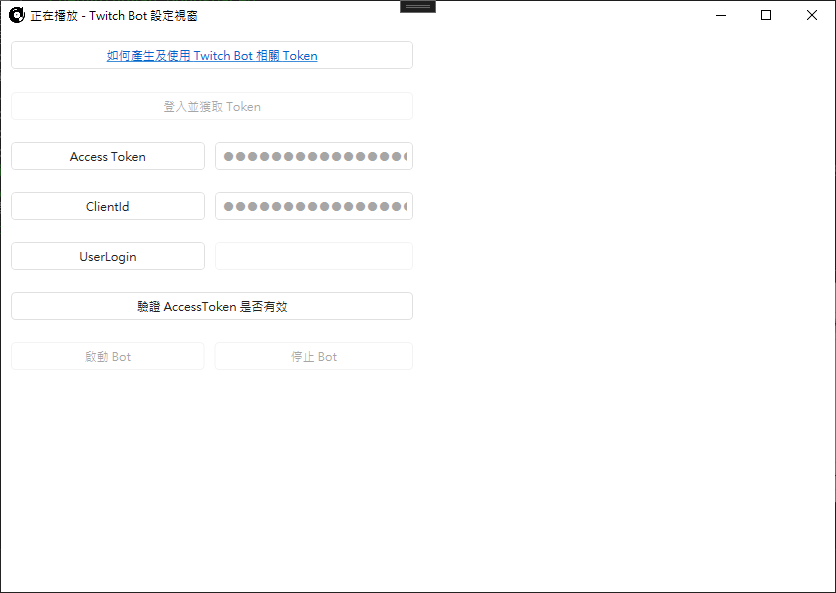
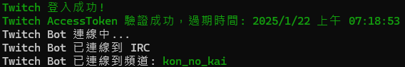
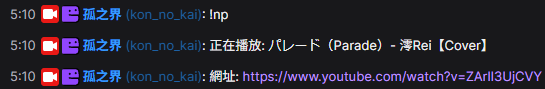
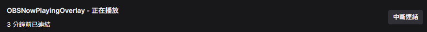

# Bot 特色
1. 可以讓使用者輸入特定指令來將目前播放的影片標題以及網址發送到聊天室上
2. 指令觸發後有 30 秒 CD 時間，防止有人洗版
3. 採用 `Implicit grant flow` 來授權 AccessToken，授權資料全都在本地運行不怕流出

# Bot 指令
| 指令 | 說明 |
| --- | --- |
| `!music`, `!playing`, `!np`, `!nowplaying`, `!正在播放`, `!音樂` | 正在播放 |

# 如何使用 Twitch Bot

1. 點擊 `登入並獲取 Token`，此時右邊視窗會出現 Twitch 登入畫面
 

2. 登入 Twitch，之後會出現 OAuth 畫面

3. 將畫面往下拉，點擊 `Authorize`

4. 若授權成功的話網頁以及登入按鈕會自動關閉
5. 點擊 `驗證 AccessToken 是否有效` 讓程式驗證，驗證成功後點擊 `啟動 Bot` 即可

> [!NOTE]
> 小黑窗的紀錄類似這樣
>
> 

> [!NOTE]
> Twitch 聊天室指令觸發後會類似這樣
>
> 

> [!TIP]
> Bot 啟動後即可關閉此設定視窗，Bot 會在背景執行，直到你手動停止或是關閉程式

> [!CAUTION]
> 記得不要取消 `OBSNowPlayingOverlay - 正在播放` 的連結授權
> 
> 

# 登入完成，關閉程式或停止 Bot 後該如何重新啟動 Bot

1. 點擊 `驗證 AccessToken 是否有效`
2. 點擊 `啟動 Bot`
3. 若 AccessToken 驗證失敗 (取消授權，因超過時間到期)，則會提示要求使用者重新登入，請按照上一章節的步驟重新登入即可

> [!NOTE]
> 因 Twitch 要求每一小時驗證一次 AccessToken 是否正常，剛好可以搭配這樣的方式來驗證

# 已知問題
1. 啟動跟停止 Bot 時有機會因為 Thread 問題導致程式卡住，需要等待一段時間讓程式回應，若過一分鐘還沒反應回來麻煩請開工作管理員強制結束
2. ~~YouTube Music 若在首頁播放音樂會獲取到錯誤的播放網址，這需要等瀏覽器插件那邊修正，若要播放 YT Music 音樂請直接點進歌曲內~~ (瀏覽器插件 v1.0.4 已修正)