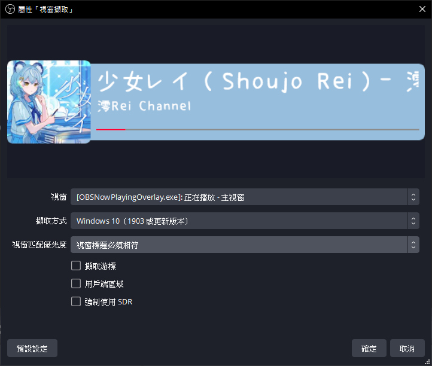
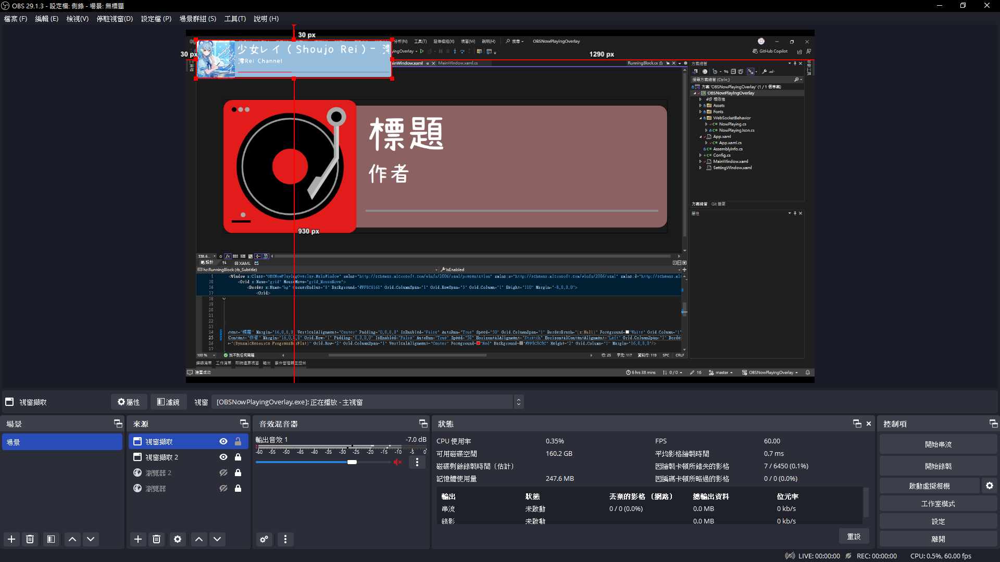
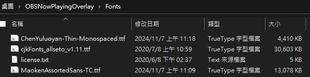
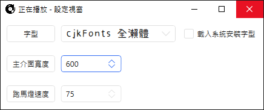

# OBSNowPlayingOverlay - 正在播放

一個可以顯示 YouTube (包含 YouTube Music)、SoundCloud、Spotify 播放狀態的小工具

起因是因為我推 ([998rrr](https://www.twitch.tv/998rrr)) 的 NowPlaying 軟體出現問題，正好拿來練手寫個工具看看

# 如何使用

1. 安裝瀏覽器插件 (還未審核完成，可自行使用開發人員模式安裝 Web Extension 內的資料，審核完之後會替換成商店連結，[參考安裝方式](https://zenreal.github.io/posts/58580/))
2. [點我下載](https://github.com/konnokai/OBSNowPlayingOverlay/releases/latest/download/OBSNowPlayingOverlay.zip) 最新版的 `OBSNowPlayingOverlay.zip` 壓縮包並解壓縮
3. 確保瀏覽器插件已安裝，並打開 `OBSNowPlayingOverlay.exe`
4. 設定想要的字型以及視窗寬度
5. 打開 OBS，新增 `視窗擷取` 來源，並按照下方圖片設定

6. 開始播放任一支援的平台音樂，若正常的話即會出現正在播放的音樂狀態

# 如何新增字型

有兩種方式

1. 直接把字型安裝到系統內，之後到設定視窗勾選 `載入系統安裝字型`
2. 將 ttf 或 otf 字型檔案丟到程式的 `Fonts` 資料夾，然後重開程式讓字型載入即可

弄完之後記得要選擇想用的字型

# 如何關閉程式

對著設定視窗點關閉，或是到工具列對兩個圖形視窗關閉都行

直接關小黑窗也能關閉，但怕資源釋放有問題，盡量避免用此方式來關

# 已知問題

關閉程式時有可能會遇到 InvalidOperationException，但因程式已關閉故無法正常拋出例外，導致整個程式出現卡死的死循環，這種情況下只能透過工作管理員強制關閉，目前尚未發現該如何避免此狀況

# 關於 & 參考專案

- [Now Playing - OBS](https://gitlab.com/tizhproger/now-playing-obs)
- [Vinyl icons](https://www.flaticon.com/free-icons/vinyl) created by Those Icons - Flaticon
- [Lp icons](https://www.flaticon.com/free-icons/lp) created by Alfredo Hernandez - Flaticon
- [Pause icons](https://www.flaticon.com/free-icons/pause) created by Debi Alpa Nugraha - Flaticon
- [cjkfonts 全瀨體](https://cjkfonts.io/blog/cjkfonts_allseto)
- [貓啃什錦黑 繁體中文版](https://github.com/Skr-ZERO/MaokenAssortedSans-TC)
- [辰宇落雁體](https://github.com/Chenyu-otf/chenyuluoyan_thin)